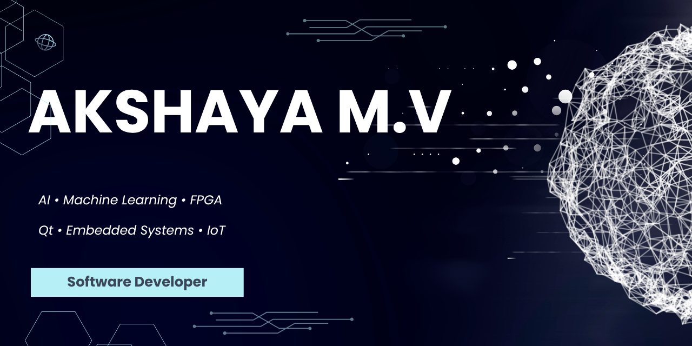

  

---

## 🚀 About Me

🎓 B.Tech Electronics and Communication Engineering @ VIT

💻 Passionate about software development, problem-solving, and building real-world applications.

🤖 Currently exploring and learning:
- Artificial Intelligence & Machine Learning
- Python for AI/ML
- Data Structures & Algorithms
- Computer Networks
- Database Management Systems
- Qt Application Development

🌱 Interested in:
- AI & Machine Learning
- Software Development
- Embedded Systems
- IoT Applications
- Full-Stack Technologies

📚 Always learning new technologies and working on projects that bridge software and hardware.

## 🛠️ Skills & Technologies

<table>
<tr>
<td valign="top" width="50%">

### 💻 Programming
- C
- C++
- Python
- Java

### 🖥️ Software Development
- Qt Framework
- MySQL
- Git & GitHub
- VS Code

### 🤖 AI & ML
- Machine Learning Fundamentals
- Data Analysis
- Data Preprocessing
- Python for AI Applications

</td>

<td valign="top" width="50%">

### 🌐 Networking
- TCP/IP
- Socket Programming
- Serial Communication

### 🔧 Embedded Systems
- Arduino
- ESP32
- IoT Applications

### ⚡ Digital Design
- Verilog HDL
- Vivado
- Quartus Prime
- FPGA Design

</td>
</tr>
</table>

### Tools

## 💻 Featured Projects

### 🌐 TCP/IP Communication Application
- Developed client-server communication using TCP/IP protocols
- Implemented socket programming concepts
- Real-time data transmission and network communication

### 🖥️ Qt GUI with MySQL Database
- Designed interactive desktop applications using Qt Framework
- Integrated MySQL database for data storage and retrieval
- Implemented user-friendly interfaces and database operations

### 🔌 Serial Port Communication System
- Developed communication between devices using serial interfaces
- Implemented data monitoring and transmission mechanisms
- Gained practical experience in communication protocols

### 🤖 AI & Machine Learning Journey
- Exploring Machine Learning algorithms and AI fundamentals
- Working with Python for data analysis and model development
- Building projects to strengthen practical AI/ML skills

### 🚨 Smart Knock Detection System
- Developed an ESP32-based smart alert system
- Processed sensor inputs and generated notifications
- Integrated buzzer and LED alerts for real-time feedback

### 📏 Ultrasonic Distance Monitoring System
- Built an Arduino-based distance measurement system
- Integrated ultrasonic sensors with alert mechanisms
- Implemented real-time obstacle detection
---

## 🎓 Internship Experience

### 🔬 Internship Trainee | IGCAR & MAPS, Kalpakkam

Gained hands-on experience in software development, communication protocols, and embedded systems through practical assignments and real-world applications.

#### Key Areas of Work
- 🌐 Developed applications using TCP/IP communication concepts
- 🔗 Implemented client-server communication through Socket Programming
- 📡 Explored Serial Port Communication for device interfacing
- 🖥️ Designed desktop applications using the Qt Framework
- 🗄️ Integrated MySQL databases for data storage and management
- 🤖 Interfaced Arduino-based sensors and embedded devices
- ⚡ Worked on software-hardware communication and system integration

#### Skills Acquired
`C++` `Qt` `MySQL` `TCP/IP` `Socket Programming` `Serial Communication` `Arduino` `Embedded Systems`
---

## 📊 GitHub Stats

  
  

  

---

<h3 align="center">
✨ Thanks for visiting! Let's build something amazing together 🚀
</h3>

